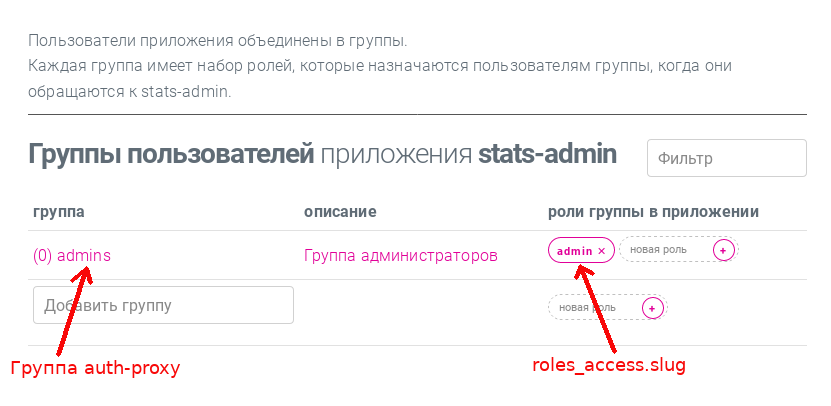

# Пример подключение приложения к auth-proxy

## Локальное проксирование приложения

При запуске auth-proxy и локальном проксировании приложения важно понимать, что ссылки с localhost нельзя проксировать (работать не будет). Поэтому вместо localhost используйте host.docker.internal.
На Windows и MacOS host.docker.internal будет работать из коробки. В Linux нужно использовать секцию extra_hosts в docker-compose.yml вашего приложения следующим образом:

```
extra_hosts:
  - "host.docker.internal:host-gateway"
```

Далее вся работа будет выполнятся на примере локального проксирования приложения stats-admin.

Приложение stats-admin локально использует порт `7879`.
Точка входа graphql: http://localhost:7879/schema


### Регистрация нового приложения

1. Выполните локальный запуск приложения stats-admin.
2. Выполните локальный запуск auth-proxy
3. Зайдите в админку: `http://localhost:4400/admin/?url=http://localhost:4400` (логин: adimin, пароль: rosgas2011).

4. Зарегистрируйте новое приложение (укажите appname и url)

Для примера, в качестве appname  укажите `stats-admin`, в качестве url укажите `http://host.docker.internal:7879`.


### Доступы приложения

В самом приложении необходимо создать список permissions, которые будут использоваться для доступа к той или иной части приложения.

Например так:
```go
// Максимальное значение uint64 в golang 18446744073709551615 (т.е 65 значений)
package role

const (
	// Доступ  - смотреть статистику по дням
	ViewVisitsByDays = 1 << iota // возведение в степень 2

	// Доступ  - смотреть статистику по месяцам
	ViewVisitsByMonths

// Получится список:
// - role.ViewVisitsByDays == 1
// - role.ViewVisitsByMonths == 2
// и т.д. если нужно больше permisions
)
```


### Доступы и роли приложения

Каждое приложение, которое планируется использовать с auth-proxy должно иметь в базе данных таблицу roles_access вида:

```sql
--
-- Структура таблицы доступов для роли
--
CREATE TABLE IF NOT EXISTS roles_access
(
    "id"         SERIAL  NOT NULL PRIMARY KEY,
    "name"       text    NOT NULL CHECK (name <> ''),
    "slug"       text    NOT NULL CHECK (slug <> ''),
    "mask"       bigint  NOT NULL,
    "created_at" integer NOT NULL DEFAULT extract(epoch FROM current_timestamp(0)),
    UNIQUE (id),
    UNIQUE (name),
    UNIQUE (slug)
);

-- добавление индекса
CREATE INDEX roles_access_slug_idx ON roles_access (slug);

```


Добавление ролей на основе permissions


```sql
-- slug - это название роли в auth-proxy
-- mask это значение, которое получается побитовым сложением значений доступов.
-- Например, ViewVisitsByDays | ViewVisitsByMonths => 3
INSERT INTO roles_access (name, slug, mask)
VALUES
('Редактор', 'editor', 3),
('Администратор', 'admin', 3);
```


### Сопоставление ролей приложения и групп auth-proxy

После регистрации нового приложения нужно указать, какие роли должен выдавать auth-proxy после успешной авторизации.

Для проксирования stats-admin необходимо для группы `admins` указать роль `admin`.




### Проверка проксирования

После регистрации в auth-proxy, приложению была выдана ссылка, по которой приложение будет доступно "за auth-proxy". В случае stats-admin ссылка будет такой `http://localhost:4400/apps/stats-admin`.


Таким образом получаются следующие точки входа:

- Точка входа graphql приложения stast-admin: `http://localhost:7879/schema`. Здесь можно проверить, что приложение работоспособно (без auth-proxy). В этом случае приложение должно использовать встроенного тестового пользователя.

- Точка входа graphql для авторизации в auth-proxy: `http://localhost:4400/schema`. Здесь необходимо авторизоваться в auth-proxy с помощью graphql-метода login:

```graphql
{login(username: "admin" password: "rosgas2011")}
```

- Точка входа graphql приложения stast-admin с использованием auth-proxy: `http://localhost:4400/apps/stats-admin/schema`. Здесь можно сделать запрос к приложению, после чего auth-proxy выдаст заоловок с данными пользователя (имя пользоватя и список ролей).


